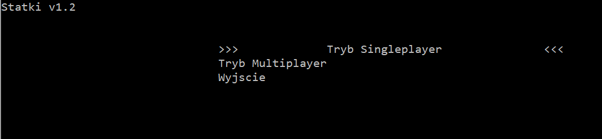
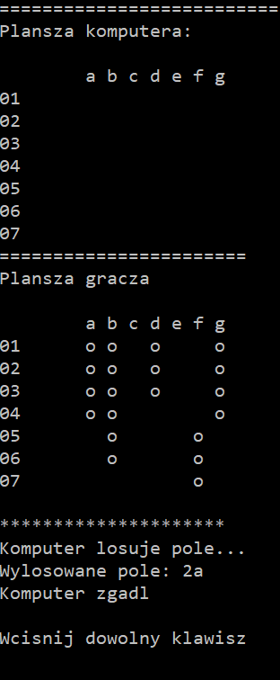

# Ships_game
> It's a small game created as a semester project at my university. It's a copy of a popular game. In my project you can play by yourself, with a computer! 
> You can find an executable file in <em>Releases</em>.

## General Information
- This project was created as a project at my university.
- The co-author of the project is [@Bart2021](https://github.com/Bart2021). My task was to create the interface menu and singleplayer. Bartek had to create multiplayer. That's the reason why <em>multiplayer</em> button doesn't work in menu.
- The game is playable, the rules are simple, you can download the .exe file and have fun!

## Technologies Used
- C++03
- OOP
- Visual Studio IDE
- GitHub Desktop

## Features
The game has many features:
- the user can't write bad coordinates for the ships,
- the level of AI represents standard user's intelligence

## Screenshots

<!---->
You can also watch a short gameplay here: https://youtu.be/Pn8GUwZKiOM

## Setup
Installation: 
Simply download and run .exe file from <em>Releases</em>.

## Project Status
Project is: _complete_. This version works well. 

## Room for Improvement
The AI could be improved, computer could guess numbers located near the correctly hit ships...

## Contact
Created by [@Bartosz-Bien](https://bartosz-bien.github.io/) - feel free to contact me!
